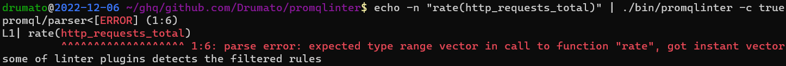

# promqlinter

A PromQL parser/type-checker/linter in GitHub Actions/CLI



## Features

- syntax/type check with [prometheus/prometheus/promql/parser](https://pkg.go.dev/github.com/prometheus/prometheus/promql/parser#Inspect)
- Use the default lint rules in GitHub Actions
  - defaults/denied-labels
  - defaults/denied-metric(WIP)
- A consistent framework to **"Build Your Own PromQL Linter"**
  - See [Build Your Own PromQL Linter](doc/custom-linter.md)

## GitHub Actions

See [Using promqlinter in GitHub Actions](doc/github-actions.md).

## CLI

```bash
$ ./bin/promqlinter -h
A PromQL linter with CLI/GitHub Actions

Usage:
  promqlinter [flags]

Examples:

        # lint a raw PromQL expression that is given from stdin
        echo -n 'http_requests_total{job="prometheus"}' | promqlinter

        # lint a raw PromQL expression in the PrometheusRule manifest
        promqlinter -i ./examples/manifests/sample.yaml

        # lint each raw PromQL expression in the PrometheusRule manifests in ./manifest
        promqlinter -r -i ./examples/manifests/

        # configure denied-label plugin
        # e.g., this example denies <vector{job="node_exporter", instance=".*"}
        promqlinter -r -i ./examples/manifests/ --denied-labels "job %PAIR% node_exporter,instance %PAIR% .*"

Flags:
  -d, --denied-labels string        the denied labels
  -h, --help                        help for promqlinter
  -i, --input-k8s-manifest string   the target PrometheusRule resource
  -f, --level-filter string         the diagnostic level filter(info/warning/error) (default "error")
  -r, --recursive                   determine whether the manifest search process should be recursive
```
